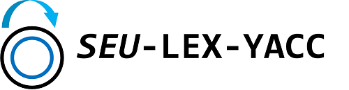

  

SEU-LEX-YACC 是东南大学计算机学院的《编译原理课程设计》，主要包括 seulex 和 seuyacc 两部分。

## seulex

seulex 是一个简化版的 lex，用于分析 .l 文件，生成词法分析器 .c 代码。

具体使用与技术细节请参考 [seulex说明文档](./doc/doc_seulex.md)。

## seuyacc​

seuyacc 是一个简化版的 yacc，用于生成语法分析器 .c 代码，与 seulex 进行联合，实现语法分析功能。

具体使用与技术细节请参考 [seuyacc说明文档](./doc/doc_seuyacc.md)。